> 🇨🇭 **Part of the [Swiss Public Data MCP Portfolio](https://github.com/malkreide)**

# 📺 srgssr-mcp


[](https://opensource.org/licenses/MIT)
[](https://www.python.org/downloads/)
[](https://modelcontextprotocol.io/)
[](https://github.com/malkreide/srgssr-mcp/actions)
[](https://developer.srgssr.ch)

> MCP server connecting AI models to SRG SSR public APIs – weather, TV/radio metadata, program guide and Swiss votations/elections since 1900 (SRF, RTS, RSI, RTR, SWI).

[🇩🇪 Deutsche Version](README.de.md)

<p align="center">
  
</p>

---

## Overview

**srgssr-mcp** gives AI assistants like Claude direct access to the public APIs of SRG SSR – Switzerland's national public broadcaster. Weather forecasts, TV and radio metadata, electronic program guides, and historical democratic data (votations and elections since 1900) are all accessible through a single standardised MCP interface.

The server covers five thematic clusters: SRF Weather, Video, Audio, EPG and Polis (Swiss Democracy). Each cluster maps to a group of purpose-built tools that translate raw SRG SSR API data into clean JSON responses.

**Anchor demo query:** *"What were the cantonal results of the popular vote on initiative X in Zurich?"* – answered with historical real-time data from the Polis system, not a hallucination.

---

## Features

- 🌦️ **Weather** – location search, current conditions, 24h hourly forecast, 7-day forecast (SRF Meteo)
- 📺 **Video** – TV show listings, latest episodes, live TV channels across all business units
- 🎙️ **Audio** – radio show listings, audio episodes, live radio stations
- 📅 **EPG** – daily program schedule for any TV or radio channel
- 🗳️ **Polis** – popular votes and elections since 1900, national and cantonal results
- 🏢 **Multi-unit** – SRF (DE), RTS (FR), RSI (IT), RTR (RM), SWI (multilingual)
- 🔐 **OAuth2** – automatic token management with Client Credentials flow
- ☁️ **Dual transport** – stdio for Claude Desktop, Streamable HTTP/SSE for cloud deployment

---

## Prerequisites

- Python 3.11+
- **API keys** from [developer.srgssr.ch](https://developer.srgssr.ch) (free registration):
  1. Create an account and log in
  2. Under "My Apps", create a new application
  3. Add the product **SRG SSR PUBLIC API V2**
  4. Note your **Consumer Key** and **Consumer Secret**

> ⚠️ **Terms of use:** SRG SSR APIs are available for non-commercial use. For commercial use, contact [api@srgssr.ch](mailto:api@srgssr.ch) directly.

---

## Installation

```bash
# Clone the repository
git clone https://github.com/malkreide/srgssr-mcp.git
cd srgssr-mcp

# Install
pip install -e .
```

Or with `uvx` (no permanent installation):

```bash
uvx srgssr-mcp
```

Or via pip:

```bash
pip install srgssr-mcp
```

---

## Quickstart

```bash
# Set credentials
export SRGSSR_CONSUMER_KEY="your-consumer-key"
export SRGSSR_CONSUMER_SECRET="your-consumer-secret"

# Start the server (stdio mode for Claude Desktop)
srgssr-mcp
```

Try it immediately in Claude Desktop:

> *"What will the weather be like in Zurich tomorrow?"*
> *"What's on SRF 1 tonight?"*
> *"Which popular votes took place in the canton of Bern between 2010 and 2020?"*

---

## Configuration

### Claude Desktop

**Minimal (recommended):**

```json
{
  "mcpServers": {
    "srgssr": {
      "command": "uvx",
      "args": ["srgssr-mcp"],
      "env": {
        "SRGSSR_CONSUMER_KEY": "your-consumer-key",
        "SRGSSR_CONSUMER_SECRET": "your-consumer-secret"
      }
    }
  }
}
```

**Config file locations:**
- macOS: `~/Library/Application Support/Claude/claude_desktop_config.json`
- Windows: `%APPDATA%\Claude\claude_desktop_config.json`

After saving, restart Claude Desktop completely.

### Other MCP Clients

Compatible with Cursor, Windsurf, VS Code + Continue, LibreChat, Cline, and self-hosted models via `mcp-proxy`. Set the same environment variables.

### Cloud Deployment (SSE for browser access)

For use via **claude.ai in the browser** (e.g. on managed workstations without local software):

```bash
SRGSSR_CONSUMER_KEY=... \
SRGSSR_CONSUMER_SECRET=... \
SRGSSR_MCP_TRANSPORT=streamable-http \
SRGSSR_MCP_HOST=0.0.0.0 \
SRGSSR_MCP_PORT=8000 \
  python -m srgssr_mcp.server
```

Transport, host, port and mount path are all driven by environment variables
(see `srgssr_mcp.server.Settings`). Valid values for `SRGSSR_MCP_TRANSPORT`
are `stdio` (default), `sse`, and `streamable-http`.

> 💡 *"stdio for the developer laptop, SSE for the browser."*

---

## MCP Primitives

This server exposes all three orthogonal MCP primitives:

| Primitive | Mental model | What's here |
|---|---|---|
| **Tools** (verbs) | Executable functions / parametrized queries | 15 tools — search, list, fetch, aggregate |
| **Resources** (nouns) | Cache-friendly passive data behind URIs | EPG entries and immutable votation results |
| **Prompts** (recipes) | Reusable workflow templates | Voting analysis & daily briefing |

Tools cover parametrized searches (year ranges, free-text, paginated listings) where every call may yield different results. Resources expose stable data points that are safe to cache: a published EPG for a given channel/date, or the final result of a closed Swiss votation. Prompts standardise recurring multi-step analyses so users don't have to phrase them from scratch.

### Resources

| URI template | Description |
|---|---|
| `epg://{bu}/{channel_id}/{date}` | Daily TV/radio program guide for SRF, RTS, RSI (e.g. `epg://srf/srf1/2026-04-30`) |
| `votation://{votation_id}` | Detailed result of a closed Swiss popular vote (e.g. `votation://v1`) |

### Prompts

| Name | Arguments | Purpose |
|---|---|---|
| `analyse_abstimmungsverhalten` | `votation_id`, `focus` (`stadt_land` / `sprachregionen` / `kantone`) | Structured analysis of a Swiss popular vote |
| `tagesbriefing_kanton` | `location`, `channel_id`, `business_unit`, `date` | Daily briefing combining weather and EPG |

---

## Available Tools

### Tool Naming Convention

This server uses **`snake_case`** for tool names, following Python ecosystem idioms. While MCP best practice favors `camelCase` for optimal LLM tokenization, `snake_case` remains acceptable and keeps tool names aligned with the underlying Python function identifiers.

All tools follow the pattern `srgssr_<domain>_<action>` with the namespace prefix `srgssr_` and a semantically meaningful `<domain>_<action>` suffix (e.g. `srgssr_weather_current`, `srgssr_polis_get_votations`).

### 🌦️ SRF Weather (4 tools)

| Tool | Description | Data Source |
|---|---|---|
| `srgssr_weather_search_location` | Search for a location by name or postal code to obtain a `geolocationId` | SRF Meteo |
| `srgssr_weather_current` | Current weather conditions for a Swiss location | SRF Meteo |
| `srgssr_weather_forecast_24h` | Hourly 24-hour forecast | SRF Meteo |
| `srgssr_weather_forecast_7day` | Daily 7-day forecast | SRF Meteo |

### 📺 Video (3 tools)

| Tool | Description | Data Source |
|---|---|---|
| `srgssr_video_get_shows` | List TV shows for a business unit | SRG SSR IL |
| `srgssr_video_get_episodes` | Retrieve latest episodes of a show | SRG SSR IL |
| `srgssr_video_get_livestreams` | List live TV channels | SRG SSR IL |

### 🎙️ Audio (3 tools)

| Tool | Description | Data Source |
|---|---|---|
| `srgssr_audio_get_shows` | List radio shows for a business unit | SRG SSR IL |
| `srgssr_audio_get_episodes` | Retrieve audio episodes of a show | SRG SSR IL |
| `srgssr_audio_get_livestreams` | List live radio stations | SRG SSR IL |

### 📅 EPG – Electronic Program Guide (1 tool)

| Tool | Description | Data Source |
|---|---|---|
| `srgssr_epg_get_programs` | Daily program schedule for a TV or radio channel | SRG SSR IL |

### 🗳️ Polis – Swiss Democracy (3 tools)

| Tool | Description | Data Source |
|---|---|---|
| `srgssr_polis_get_votations` | Popular votes since 1900 (national or cantonal) | Polis API |
| `srgssr_polis_get_votation_results` | Detailed results of a specific vote | Polis API |
| `srgssr_polis_get_elections` | Election results since 1900 | Polis API |

### Supported Business Units

| Code | Unit | Language |
|---|---|---|
| `srf` | SRF (Schweizer Radio und Fernsehen) | German |
| `rts` | RTS (Radio Télévision Suisse) | French |
| `rsi` | RSI (Radiotelevisione svizzera) | Italian |
| `rtr` | RTR (Radiotelevisiun Svizra Rumantscha) | Romansh |
| `swi` | SWI swissinfo.ch | Multilingual |

### Example Use Cases

| Query | Tool |
|---|---|
| *"Weather in Zurich tomorrow?"* | `srgssr_weather_forecast_24h` |
| *"What's on SRF 1 tonight?"* | `srgssr_epg_get_programs` |
| *"Latest Tagesschau episodes?"* | `srgssr_video_get_episodes` |
| *"Popular votes in Canton Bern 2010–2020?"* | `srgssr_polis_get_votations` |
| *"Cantonal results of the mask initiative vote?"* | `srgssr_polis_get_votation_results` |
| *"All current RTS radio shows?"* | `srgssr_audio_get_shows` |

→ [More use cases by audience](EXAMPLES.md) →

---

## Architecture

```
┌─────────────┐
│ Claude / LLM│
└──────┬──────┘
       │ MCP (stdio)
┌──────▼───────────────────┐
│ srgssr-mcp Server        │
│  ├─ Weather Tools (4)    │
│  ├─ EPG Tools (1)        │
│  ├─ Polis Tools (3)      │
│  ├─ Video Tools (3)      │
│  └─ Audio Tools (3)      │
└──────┬───────────────────┘
       │ HTTPS (OAuth2)
┌──────▼──────────────┐
│ SRG SSR Public APIs │
│  developer.srgssr.ch│
└─────────────────────┘
```

### Data Sources

| Source | Data | Access |
|---|---|---|
| [developer.srgssr.ch](https://developer.srgssr.ch) | SRG SSR PUBLIC API V2 (weather, A/V, EPG, Polis) | OAuth2 (free registration) |

**Attribution:** SRG SSR APIs are subject to the [SRG SSR Terms of Use](https://developer.srgssr.ch).

---

## MCP Protocol Version

This server is built and tested against MCP protocol version **`2025-06-18`**.

The version is pinned explicitly as `PROTOCOL_VERSION` in [`src/srgssr_mcp/_app.py`](src/srgssr_mcp/_app.py) and validated at import time against the installed SDK's `SUPPORTED_PROTOCOL_VERSIONS` — a `fastmcp`/`mcp` upgrade that drops support for the pinned revision will fail fast at startup instead of silently changing wire-level behaviour. Bumps are tracked in [CHANGELOG.md](CHANGELOG.md) under the matching release.

### Update Policy

- SDK dependency updates land via Dependabot (`.github/dependabot.yml`, monthly cadence, grouped under the `mcp-sdk` label) and run the full test suite before merge.
- Spec bumps are evaluated on a feature branch against the relevant MCP SDK release; the [official MCP changelog](https://modelcontextprotocol.io/specification/draft/changelog) is the source of truth for breaking changes.
- A spec-version bump is always documented in `CHANGELOG.md` and, if it changes the externally observable wire contract, triggers a minor or major release per [Semantic Versioning](https://semver.org/).

---

## Project Structure

```
srgssr-mcp/
├── src/srgssr_mcp/
│   ├── __init__.py          # Package
│   └── server.py            # FastMCP server: 14 tools, OAuth2 client
├── .github/
│   └── workflows/
│       └── ci.yml           # GitHub Actions CI (Python 3.11–3.13)
├── pyproject.toml           # Build configuration (hatchling)
├── CHANGELOG.md
├── CONTRIBUTING.md          # English
├── CONTRIBUTING.de.md       # German
├── LICENSE                  # MIT
├── README.md                # This file (English)
└── README.de.md             # German version
```

---

## 🛡️ Safety & Limits

| Aspect | Details |
|--------|---------|
| **Access** | Read-only — the server only reads from SRG SSR APIs and cannot post, modify or delete any content |
| **Personal data** | No personal data — all endpoints serve public broadcast metadata, weather observations and historical votation/election results |
| **Rate limits** | Subject to the tier of your OAuth2 application on [developer.srgssr.ch](https://developer.srgssr.ch); the server adds sensible per-query caps (e.g. max 100 episodes, 50 shows per list call) |
| **Timeout** | 30 seconds per upstream API call |
| **Authentication** | OAuth2 Client Credentials (free registration); secrets stay local, never logged |
| **Licensing & use** | SRG SSR APIs are for **non-commercial use**; commercial use requires written permission from [api@srgssr.ch](mailto:api@srgssr.ch) |
| **Terms of Service** | Subject to the [SRG SSR Developer Terms of Use](https://developer.srgssr.ch) — users remain responsible for attribution and compliance |

---

## Known Limits

- **Rate Limits:** SRG SSR APIs enforce rate limits — see [developer.srgssr.ch](https://developer.srgssr.ch) for details on the tier of your OAuth2 application
- **Data Freshness:** EPG data may be delayed by up to 6 hours
- **Historical Data:** Polis data goes back to 1900 — older data is not available
- **Geo-Restriction:** Some streaming APIs are only available within Switzerland
- **API keys required:** SRG SSR APIs require free OAuth2 credentials from [developer.srgssr.ch](https://developer.srgssr.ch)
- **Non-commercial use:** SRG SSR API terms restrict commercial use without explicit permission from [api@srgssr.ch](mailto:api@srgssr.ch)
- **Weather coverage:** SRF Meteo covers Switzerland only

---

## Testing

```bash
# Unit tests (no network required)
PYTHONPATH=src pytest tests/ -m "not live"

# Integration tests (requires SRG SSR API keys)
PYTHONPATH=src pytest tests/ -m "live"

# Linting
ruff check src/
```

---

## Contributing

See [CONTRIBUTING.md](CONTRIBUTING.md)

---

## Changelog

See [CHANGELOG.md](CHANGELOG.md)

---

## License

MIT License — see [LICENSE](LICENSE)

The SRG SSR APIs used in this project are subject to the [SRG SSR Terms of Use](https://developer.srgssr.ch).

---

## Author

Hayal Oezkan · [github.com/malkreide](https://github.com/malkreide)

---

## Credits & Related Projects

- **Data:** [SRG SSR Developer Portal](https://developer.srgssr.ch) · SRF Meteo · Polis API
- **Protocol:** [Model Context Protocol](https://modelcontextprotocol.io/) – Anthropic / Linux Foundation
- **Related:**

| Server | Description |
|---|---|
| [zurich-opendata-mcp](https://github.com/malkreide/zurich-opendata-mcp) | City of Zurich open data (OSTLUFT air quality, weather, parking, geodata) |
| [swiss-transport-mcp](https://github.com/malkreide/swiss-transport-mcp) | Swiss public transport – OJP 2.0 journey planning, SIRI-SX disruptions |
| [swiss-environment-mcp](https://github.com/malkreide/swiss-environment-mcp) | BAFU environmental data – air quality, hydrology, natural hazards |
| [swiss-statistics-mcp](https://github.com/malkreide/swiss-statistics-mcp) | BFS STAT-TAB – 682 statistical datasets |
| [fedlex-mcp](https://github.com/malkreide/fedlex-mcp) | Swiss federal law via Fedlex SPARQL |

**Synergy example:** *"What were the results of the 2020 popular votes in Canton Zurich – and how did turnout compare to the national average?"*
→ `srgssr-mcp` (Polis, cantonal results) + `swiss-statistics-mcp` (BFS, turnout data)

- **Portfolio:** [Swiss Public Data MCP Portfolio](https://github.com/malkreide)
